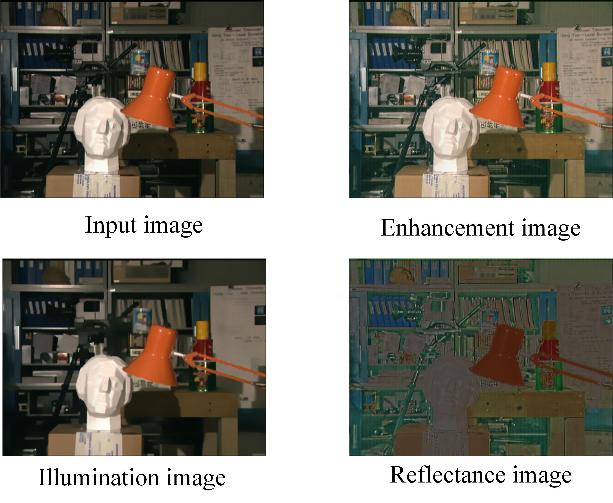

# retinex-model-baseline
This repository provides a c++ source code to decompose an observed image ***O*** into illumination ***S*** and reflectance ***R*** components  
***0=SxR***  
according to the objective function  
**min(||** ***O-SxR*** **||** + ***\lamda*** **||** ***S*** **||** + ***\lamda*** **||** ***S*** **||**
\epsilon

